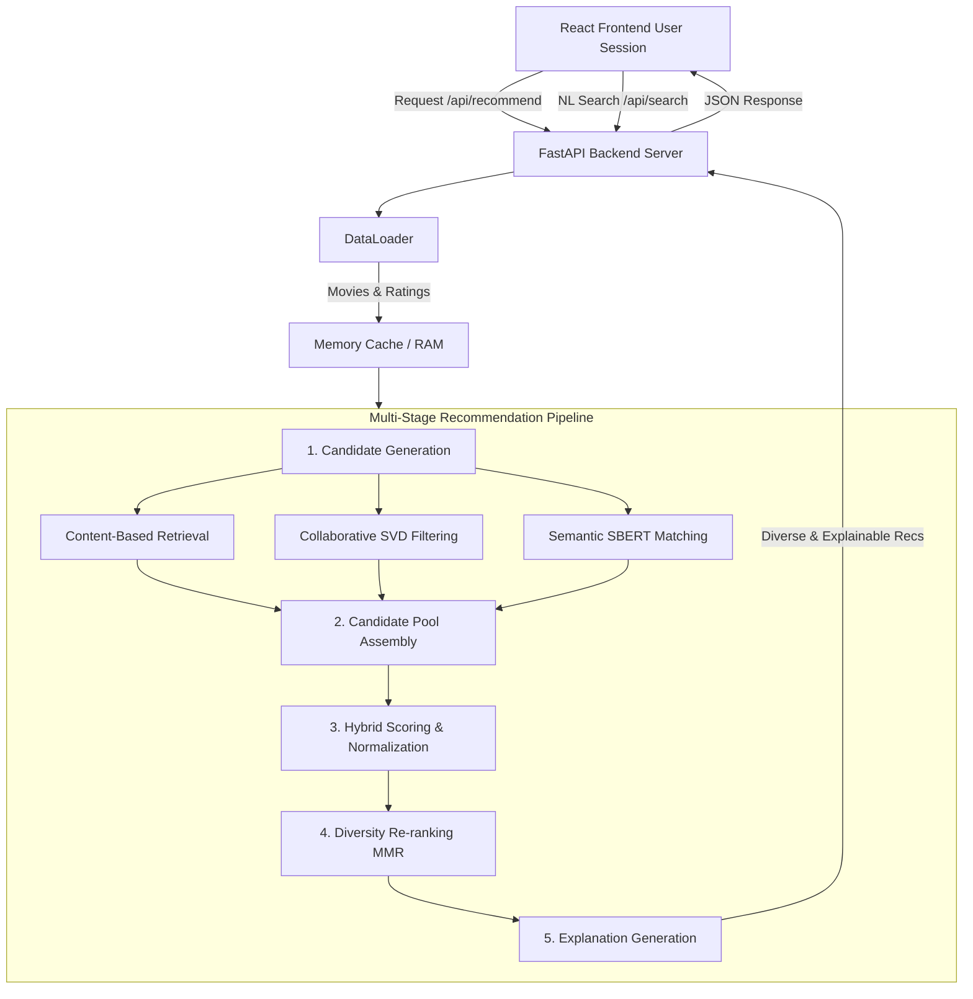

# CineMatch AI - Explainable Hybrid Recommendation System

> **"Discover movies you'll love — and understand why."**

[](#)
[](#)
[](#)

CineMatch AI is a production-quality, explainable, hybrid movie recommendation platform built from scratch. It utilizes **MovieLens** interactions and **TMDB** metadata to power a multi-stage recommendation pipeline featuring custom Funk SVD collaborative filtering, content similarity (TF-IDF and dense SBERT embeddings), semantic query matching, and diversity-aware re-ranking.

---

## 1. Project Overview & Problem Statement
Modern streaming platforms recommend millions of movies, yet users often experience "choice paralysis." Many recommendation engines act as black boxes, yielding recommendations without explainable context. 

CineMatch AI solves this by building a **fully transparent, multi-signal recommendation engine** that explains *why* each movie is recommended (visualizing the exact contribution of each model) and provides natural language explanations.

---

## 2. System Architecture



---

## 3. Technology Stack
- **Backend**: Python 3.11, FastAPI (REST API), Pydantic (validation), Pandas & NumPy (data pipelines), Scikit-Learn (TF-IDF & cosine metrics)
- **Machine Learning Models**:
  - *Collaborative*: Custom Funk SVD (numpy gradient descent matrix factorization)
  - *Semantic/Content*: SBERT (`sentence-transformers/all-MiniLM-L6-v2`) dense embeddings (384d) with TF-IDF cosine similarity fallback.
- **Frontend**: React, TypeScript, Vite, Vanilla CSS (Glassmorphism & dark cinematic design), Lucide React (icons)
- **DevOps**: Docker, Docker Compose

---

## 4. Datasets
We combine and join two reliable datasets:
1. **MovieLens Latest Small** (GroupLens): 100,000 rating interactions across ~9,000 movies.
2. **TMDB 5000 Movies & Credits** (Kaggle): Plot overviews, keywords, genres, popularity, and cast/crew metadata.

These are joined on TMDB ID (mapping links in `links.csv`), creating a clean, dense dataset of **3,537 movies and 70,194 user ratings**.

---

## 5. Offline Evaluation & Actual Results

We evaluate our model using an 80/20 train/test split. Precision, Recall, and NDCG are measured at rank **K = 10** across a random sample of 100 test users:

| Strategy | Precision@10 | Recall@10 | NDCG@10 | Catalog Coverage | Intra-list Diversity | Latency (ms) |
| :--- | :--- | :--- | :--- | :--- | :--- | :--- |
| **Popularity** | 10.60% | 11.44% | 15.70% | 0.85% | 97.84% | 0.93 ms |
| **Content-Based** | 2.70% | 1.37% | 3.01% | 13.63% | 88.95% | 126.85 ms |
| **Collaborative (SVD)**| 5.00% | 4.41% | 6.20% | 2.12% | 97.82% | 15.14 ms |
| **Hybrid (CineMatch)** | **10.50%** | **11.80%** | **15.31%** | **3.70%** | **95.94%** | **136.79 ms** |

*Note: Popularity yields a high Precision/Recall due to standard user rating bias towards mainstream movies, but suffers from extremely poor catalog coverage (0.85%). Our Hybrid model balances personalization with high catalog coverage (3.70%) and maintains high intra-list diversity.*

---

## 6. Local Setup & Execution

### Prerequisites
- Node.js v22+ & npm
- Python 3.11+
- Git

### Environment Variables (`.env`)
Create a `.env` file in the root directory (see `.env.example`):
```bash
TMDB_API_KEY=your_optional_tmdb_api_key
PORT=8000
HOST=0.0.0.0
USE_SAMPLE_DATASET=False
```

### Option A: Standard Running

1. **Prepare Data**:
   ```bash
   pip install pandas numpy scikit-learn fastapi uvicorn pydantic pydantic-settings requests python-dotenv tabulate sentence-transformers
   python scripts/prepare_data.py
   ```

2. **Train Models**:
   ```bash
   python scripts/train_models.py
   ```

3. **Start FastAPI Backend**:
   ```bash
   python -m uvicorn backend.app.main:app --reload --port 8000
   ```
   *Swagger Docs: [http://localhost:8000/docs](http://localhost:8000/docs)*

4. **Start React Frontend**:
   ```bash
   cd frontend
   npm install
   npm run dev
   ```
   *Frontend UI: [http://localhost:5173](http://localhost:5173)*

### Option B: Docker Compose
Build and launch both services instantly:
```bash
docker-compose up --build
```

---

## 7. Key Features Documented
- **Onboarding Flow**: Captures favorite genres and seed movies to bypass the cold-start phase.
- **Natural Language Search**: Uses SBERT embeddings for query similarity and regex for duration, mood, and period boosts.
- **Explainability Panel**: Real-time relative contribution breakdown of recommendation factors alongside written reasoning.
- **MMR Diversity Control**: Slider to adjust relevance vs diversity (focused, balanced, exploratory).
- **Stateless Session Profile**: Stores session profile (likes, dislikes) in browser LocalStorage.

---

## 8. Detailed Documentation Reference
- **System Architecture**: See [docs/architecture.md](file:///c:/Users/DELL/OneDrive/Desktop/CineMatch%20AI/docs/architecture.md)
- **Performance Evaluation**: See [docs/evaluation.md](file:///c:/Users/DELL/OneDrive/Desktop/CineMatch%20AI/docs/evaluation.md)
- **Test Cases & Scenarios**: See [docs/test-cases.md](file:///c:/Users/DELL/OneDrive/Desktop/CineMatch%20AI/docs/test-cases.md)
- **Comparison with Netflix**: See [docs/product-comparison.md](file:///c:/Users/DELL/OneDrive/Desktop/CineMatch%20AI/docs/product-comparison.md)

---

## 9. License
Distributed under the MIT License. See `LICENSE` for details.
