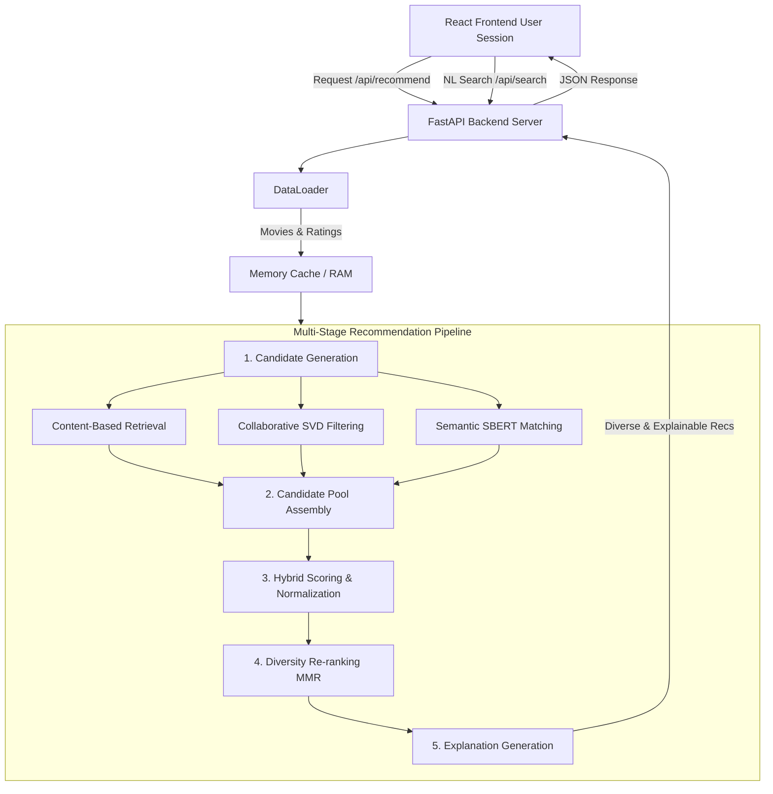

# CineMatch AI - System Architecture

CineMatch AI implements a production-grade, multi-stage hybrid recommendation pipeline inspired by industrial recommendation designs (like Netflix and Spotify) but scaled for local, low-latency execution.

---

## 1. System Topology & Data Flow

---

## 2. Recommendation Engine Modules

### A. Candidate Generation
To minimize latency, the system gathers the top 300 candidates from each sub-recommender, filters out movies the user has already watched (liked/disliked) in their session profile, and merges them into a candidate pool of up to 500 unique items.

### B. Collaborative Filtering (Funk SVD)
The collaborative filtering engine is built from scratch in NumPy using the **Funk SVD** (Matrix Factorization) algorithm.
- **Model Equation**:
  The predicted rating $\hat{R}_{u, i}$ for user $u$ on item $i$ is modeled as:
  $$\hat{R}_{u, i} = \mu + b_u + b_i + P_u \cdot Q_i$$
  Where:
  - $\mu$: Global rating average.
  - $b_u$: Bias of user $u$ (captures users who tend to rate higher or lower than average).
  - $b_i$: Bias of movie $i$ (captures overall movie popularity/quality).
  - $P_u$: Latent factor vector of user $u$ (shape: $1 \times K$).
  - $Q_i$: Latent factor vector of movie $i$ (shape: $1 \times K$).
  - $K$: Latent space dimension (default: 20).

- **Training Loop**:
  Parameters are learned by minimizing the squared error over the training interactions using stochastic gradient descent (SGD):
  $$e_{u, i} = R_{u, i} - \hat{R}_{u, i}$$
  $$b_u \leftarrow b_u + \gamma (e_{u, i} - \lambda b_u)$$
  $$b_i \leftarrow b_i + \gamma (e_{u, i} - \lambda b_i)$$
  $$P_u \leftarrow P_u + \gamma (e_{u, i} Q_i - \lambda P_u)$$
  $$Q_i \leftarrow Q_i + \gamma (e_{u, i} P_u - \lambda Q_i)$$
  Where $\gamma$ is the learning rate (0.005) and $\lambda$ is the regularization weight (0.02) to prevent overfitting.

### C. Content-Based Recommender
- **soup Representation**:
  Combines textual metadata (overviews, genres, keywords, cast, and director) into a single text document representation.
- **TF-IDF Vectorization**:
  Extracts 5,000 TF-IDF features. Cosine similarity calculates similarities.
- **Sentence Transformer Embeddings (Advanced)**:
  Uses the `all-MiniLM-L6-v2` Sentence Transformer model to generate 384-dimensional dense semantic vectors. Cached as `.npy` at training time to ensure instantaneous startup and recommendation latency.
- **User Taste Vector**:
  Represents user feedback dynamically in memory:
  $$\text{UserPreferenceVector} = \frac{1}{|L|} \sum_{l \in L} \vec{V}_l - 0.5 \cdot \frac{1}{|D|} \sum_{d \in D} \vec{V}_d$$
  Where $L$ is the set of liked movies, $D$ is the set of disliked movies, and $\vec{V}$ represents the movie vector (dense or sparse).

### D. Semantic Recommender (Natural Language Search)
- Encodes natural language queries (e.g. "dark psychological thriller") using the same dense SBERT model or fallback TF-IDF vectorizer.
- Computes cosine similarity to all movie vectors.
- Applies regex keyword parsing to detect explicit genre interests, duration limits (short/long), and release periods (classic/recent) to soft-boost matching candidates (up to $+0.1$ score boost).

### E. Hybrid Ranker & Normalization
Min-max normalizes scores from all modules to the $[0, 1]$ interval. Scores are combined using a configurable weight dictionary:
$$\text{FinalScore} = \sum_{j} w_j \cdot \text{Score}_j$$
The system supports three user-profile weight strategies:
1. **Cold Start**: redistributes weights from collaborative filtering ($0.0$) to content-based ($0.35$), semantic ($0.30$), and genres ($0.20$).
2. **Sparse History**: uses collaborative lightly ($0.10$) and content heavily ($0.40$).
3. **Warm User**: uses collaborative SVD ($0.25$), content ($0.30$), and semantic ($0.20$).

*Weights are centrally managed in `backend/app/core/config.py` and are redistributed dynamically if no search query is present.*

### F. Diversity Re-ranking (MMR)
To avoid recommendation fatigue (e.g., showing 10 superhero movies in a row), candidates are re-ranked using **Maximal Marginal Relevance (MMR)**:
$$\text{MMR\_Score}(d_i) = \lambda \cdot \text{Relevance}(d_i) - (1 - \lambda) \cdot \max_{d_j \in S} \text{Similarity}(d_i, d_j)$$
Where:
- $S$: The set of already selected recommendations.
- $\text{Similarity}(d_i, d_j)$: Cosine similarity between content vectors.
- $\lambda$: User-adjustable diversity trade-off:
  - Focused: $\lambda = 1.0$ (recommends by pure relevance).
  - Balanced: $\lambda = 0.5$ (50/50 balance).
  - Exploratory: $\lambda = 0.2$ (prioritizes high diversity).

### G. Explanation Generator
Calculates relative score contribution percentages:
$$\text{Contribution}_j = \frac{w_j \cdot \text{Score}_j}{\text{FinalScore}}$$
Identifies the top two contributors and translates them into a personalized explanation (e.g. "Recommended because it shares similar themes, genres, and style with 'Inception' which you liked, and is favored by users with similar taste patterns").
